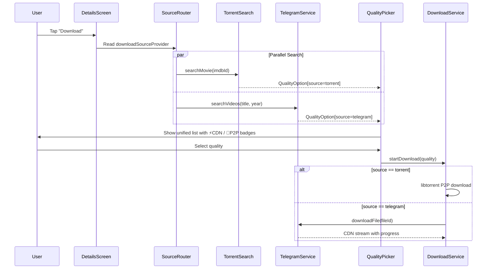

# Atmos App — Dependency Graph

> **22 Dart source files** · **6,945 lines** (excl. generated) · **1 Cloudflare Worker** (234 lines)

---

## Dependency Graph Report - Atmos App

Last Updated: 2026-04-30

## Summary
- **380 nodes** · **437 edges** · **25 communities** detected.
- **Corpus Size:** 35 files · ~26,197 words.

## Core Abstractions (God Nodes)
1. `package:flutter/material.dart` (13 edges) - Central UI framework.
2. `../theme/app_theme.dart` (11 edges) - **Critical Bridge:** Connects all UI communities through the new Material 3 system.
3. `../models/media_model.dart` (9 edges) - Core data structures.
4. `../providers/providers.dart` (6 edges) - State management hub.

## Key Communities
- **Community 0:** `DownloadService`, `DownloadTask`, `libtorrent_flutter` - Core logic.
- **Community 1-3:** UI Screens (`HomeScreen`, `DownloadScreen`, `DetailsScreen`) - Now fully unified under M3.
- **Community 9:** Theming & Adaptive Shell (`app_tokens.dart`, `AtmosTheme`, `AdaptiveShell`).

## Knowledge Gaps & Observations
- **Isolated Nodes:** 310 isolated nodes detected. Most are standard Flutter/Dart libraries or helper scripts like `replace_all.py`.
- **Bridge Strength:** `app_theme.dart` has become a primary bridge (Centrality: 0.168), confirming the success of the centralization effort.
- **Extraction:** 100% extracted, 0% ambiguous.

---
*Generated via `graphify update .`*

## Full Architecture Graph

```mermaid
graph TB
    subgraph Entry["🚀 Entry Point"]
        MAIN["main.dart<br/>145 lines"]
    end

    subgraph Screens["📱 Screens (6)"]
        HOME["home_screen.dart<br/>708 lines"]
        SEARCH["search_screen.dart<br/>190 lines"]
        DETAILS["details_screen.dart<br/>821 lines"]
        PLAYER["player_screen.dart<br/>571 lines"]
        DOWNLOAD["download_screen.dart<br/>700 lines"]
        SETTINGS["settings_screen.dart<br/>766 lines"]
    end

    subgraph Providers["🔌 State (1)"]
        PROV["providers.dart<br/>125 lines"]
    end

    subgraph Services["⚙️ Services (6)"]
        TMDB["tmdb_service.dart<br/>204 lines"]
        HISTORY["history_service.dart<br/>88 lines"]
        DL_SVC["download_service.dart<br/>375 lines"]
        TORRENT["torrent_search_service.dart<br/>313 lines"]
        TELEGRAM["telegram_service.dart<br/>599 lines"]
        EXTRACT["extractor_service.dart<br/>85 lines"]
    end

    subgraph Models["📦 Models (4)"]
        MEDIA_M["media_model.dart<br/>290 lines"]
        DL_M["download_model.dart<br/>155 lines"]
        DL_SRC["download_source.dart<br/>39 lines"]
        TG_RESULT["telegram_search_result.dart<br/>93 lines"]
    end

    subgraph Widgets["🧩 Widgets (3)"]
        MEDIA_C["media_card.dart<br/>290 lines"]
        EP_TILE["episode_tile.dart<br/>168 lines"]
        RESP_L["responsive_layout.dart<br/>46 lines"]
    end

    subgraph Theme["🎨 Theme (1)"]
        THEME["app_theme.dart<br/>174 lines"]
    end

    subgraph External["🌐 External APIs"]
        TMDB_API["TMDB API<br/>themoviedb.org"]
        TORRENTIO_API["Torrentio API<br/>torrentio.strem.fun"]
        TG_CDN["Telegram CDN<br/>TDLib MTProto"]
        CF_WORKER["Cloudflare Worker<br/>234 lines"]
    end

    %% Entry → Everything
    MAIN --> HOME
    MAIN --> SEARCH
    MAIN --> DETAILS
    MAIN --> PLAYER
    MAIN --> DOWNLOAD
    MAIN --> SETTINGS
    MAIN --> PROV
    MAIN --> HISTORY
    MAIN --> DL_SVC
    MAIN --> TELEGRAM
    MAIN --> DL_SRC
    MAIN --> THEME

    %% Screens → Providers
    HOME --> PROV
    SEARCH --> PROV
    DETAILS --> PROV
    DOWNLOAD --> PROV
    SETTINGS --> PROV

    %% Screens → Models
    HOME --> MEDIA_M
    SEARCH --> MEDIA_M
    DETAILS --> MEDIA_M
    DETAILS --> DL_M
    DETAILS --> DL_SRC
    DOWNLOAD --> DL_M
    SETTINGS --> DL_SRC

    %% Screens → Widgets
    HOME --> MEDIA_C
    HOME --> RESP_L
    SEARCH --> MEDIA_C
    SEARCH --> RESP_L
    DETAILS --> MEDIA_C
    DETAILS --> EP_TILE
    DETAILS --> RESP_L

    %% Screens → Screens (cross-ref)
    DETAILS --> DOWNLOAD

    %% Screens → Services
    SETTINGS --> TELEGRAM

    %% Screens → Theme
    HOME --> THEME
    SEARCH --> THEME
    DETAILS --> THEME
    PLAYER --> THEME
    DOWNLOAD --> THEME
    SETTINGS --> THEME

    %% Providers → Services + Models
    PROV --> TMDB
    PROV --> HISTORY
    PROV --> DL_SVC
    PROV --> TORRENT
    PROV --> TELEGRAM
    PROV --> MEDIA_M
    PROV --> DL_SRC

    %% Services → Models
    TMDB --> MEDIA_M
    HISTORY --> MEDIA_M
    DL_SVC --> DL_M
    DL_SVC --> TORRENT
    TORRENT --> DL_M
    TELEGRAM --> TG_RESULT
    TELEGRAM --> DL_M
    EXTRACT --> MEDIA_M

    %% Widgets → Models + Theme
    MEDIA_C --> MEDIA_M
    MEDIA_C --> THEME
    MEDIA_C --> RESP_L
    EP_TILE --> MEDIA_M
    EP_TILE --> THEME
    EP_TILE --> RESP_L
    RESP_L --> THEME

    %% External connections
    TMDB -.->|"dio HTTP"| TMDB_API
    TORRENT -.->|"http GET"| TORRENTIO_API
    TELEGRAM -.->|"TDLib JNI"| TG_CDN
    EXTRACT -.->|"dio HTTP"| CF_WORKER

    style MAIN fill:#1a1a2e,stroke:#e94560,color:#fff
    style TELEGRAM fill:#1a1a2e,stroke:#2AABEE,color:#fff
    style TORRENT fill:#1a1a2e,stroke:#ff6b35,color:#fff
    style DL_SVC fill:#1a1a2e,stroke:#ffd700,color:#fff
    style PROV fill:#1a1a2e,stroke:#00d4aa,color:#fff
```



---

## Layer Architecture

```mermaid
graph LR
    subgraph L1["Layer 1: Data"]
        direction TB
        M1["media_model"]
        M2["download_model"]
        M3["download_source"]
        M4["telegram_search_result"]
    end

    subgraph L2["Layer 2: Services"]
        direction TB
        S1["tmdb_service"]
        S2["history_service"]
        S3["download_service"]
        S4["torrent_search_service"]
        S5["telegram_service"]
        S6["extractor_service"]
    end

    subgraph L3["Layer 3: State"]
        P1["providers"]
    end

    subgraph L4["Layer 4: UI"]
        direction TB
        U1["home_screen"]
        U2["search_screen"]
        U3["details_screen"]
        U4["player_screen"]
        U5["download_screen"]
        U6["settings_screen"]
    end

    subgraph L5["Layer 5: Components"]
        direction TB
        W1["media_card"]
        W2["episode_tile"]
        W3["responsive_layout"]
    end

    L1 --> L2
    L2 --> L3
    L3 --> L4
    L5 --> L4

    style L1 fill:#0d1117,stroke:#7c3aed,color:#fff
    style L2 fill:#0d1117,stroke:#2563eb,color:#fff
    style L3 fill:#0d1117,stroke:#059669,color:#fff
    style L4 fill:#0d1117,stroke:#d97706,color:#fff
    style L5 fill:#0d1117,stroke:#dc2626,color:#fff
```



---

## Download Engine Data Flow



---

## External Dependencies

| Package | Purpose | Used By |
|---------|---------|---------|
| `flutter_riverpod` | State management | providers, all screens |
| `dio` | HTTP client | tmdb_service, extractor_service |
| `http` | HTTP client (lightweight) | torrent_search_service |
| `hive_flutter` | Local NoSQL storage | download_service, history_service |
| `handy_tdlib` | TDLib Android bindings (MTProto) | telegram_service |
| `libtorrent_flutter` | libtorrent 2.0 FFI | download_service |
| `go_router` | Navigation | main, all screens |
| `flutter_inappwebview` | WebView player | player_screen |
| `flutter_dotenv` | Env vars (.env) | main, services |
| `shared_preferences` | Settings persistence | main, settings_screen |
| `path_provider` | Storage paths | main, download_service, telegram_service |
| `permission_handler` | Storage permissions | main |

---

## File Size Distribution

```
 ┌─────────────────────────────────────────────────┐
 │ details_screen.dart       ████████████████  821  │
 │ settings_screen.dart      ███████████████   766  │
 │ home_screen.dart           ██████████████   708  │
 │ download_screen.dart       █████████████    700  │
 │ telegram_service.dart      ███████████      599  │
 │ player_screen.dart         ███████████      571  │
 │ download_service.dart      ███████          375  │
 │ torrent_search_service.dart████████          313  │
 │ media_model.dart           █████            290  │
 │ media_card.dart            █████            290  │
 │ tmdb_service.dart          ████             204  │
 │ search_screen.dart         ███              190  │
 │ app_theme.dart             ███              174  │
 │ episode_tile.dart          ███              168  │
 │ download_model.dart        ██               155  │
 │ main.dart                  ██               145  │
 │ providers.dart             ██               125  │
 │ telegram_search_result.dart█                 93  │
 │ history_service.dart       █                 88  │
 │ extractor_service.dart     █                 85  │
 │ responsive_layout.dart                       46  │
 │ download_source.dart                         39  │
 └─────────────────────────────────────────────────┘
  Total: 6,945 lines (source only)
```

---

## Key Observations

> [!TIP]
> **Clean layering**: No circular dependencies detected. Models → Services → Providers → Screens flows strictly downward.

> [!NOTE]
> **Heaviest files**: `details_screen.dart` (821), `settings_screen.dart` (766), and `home_screen.dart` (708) are the largest — all UI screens as expected.

> [!IMPORTANT]
> **Cross-screen dependency**: `details_screen.dart` imports `download_screen.dart` for `QualityPickerSheet`. Consider extracting this widget into `widgets/` if it grows further.

> [!WARNING]
> **`extractor_service.dart` (85 lines)** is orphaned — not imported by any other file. It connects to the Cloudflare Worker but nothing uses it currently.
