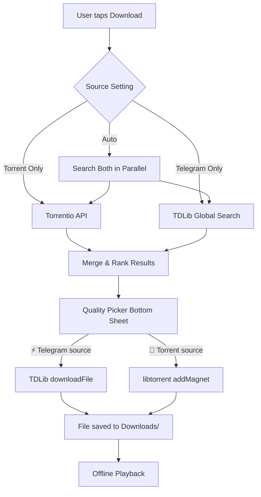

# Atmos Hybrid Download Engine V3 — Torrent + Telegram

Build a dual-source download engine that combines the **reliability of Telegram's CDN** with the **quality range of torrents**, giving users the best of both worlds.

## Architecture Overview



## How Telegram Global Search Works

Instead of hardcoding channels, we search **ALL of Telegram's public channels** using TDLib's `searchMessages` with `SearchMessagesFilterVideo`. This is exactly how apps like @SearcheeBot work:

1. User searches "The Godfather 1972"
2. TDLib queries Telegram's global index → returns video messages from ALL public channels
3. We parse captions for quality, codec, audio, language metadata
4. We match against TMDB title + year for accuracy
5. Results appear alongside torrent results in the quality picker

**This means we don't need to maintain a channel list** — Telegram's own search engine finds everything.

> [!IMPORTANT]
> **One-time Telegram login required.** Users must authenticate with their phone number + OTP in Settings. This is needed because TDLib's global search requires an authenticated session. The session persists until logout.

> [!WARNING]
> **2GB limit (free) / 4GB (premium).** Files under these limits download at full CDN speed. For larger files, we detect multi-part uploads (Part 1, Part 2, etc.) in the same channel and auto-merge them after download.

---

## Proposed Changes

### Phase 1: Core Telegram Engine (Priority)

---

#### [NEW] [telegram_service.dart](file:///home/nikhil/Desktop/atmos-app/lib/services/telegram_service.dart)

The heart of the Telegram integration. Runs TDLib in a **separate Dart Isolate** to avoid UI jank.

**Responsibilities:**
- **Auth lifecycle**: `login(phone)` → `verifyOtp(code)` → `verify2fa(password)` → `logout()`
- **Global search**: `searchMovies(title, year)` → returns `List<TelegramSearchResult>`
  - Uses `searchMessages(query, filter: SearchMessagesFilterVideo(), chatList: null)`
  - `chatList: null` = search ALL chats including public channels
  - Filters results by file size (skip < 100MB, likely fakes), and by caption matching (year, title fuzzy match)
- **Download**: `downloadFile(fileId, priority)` → streams progress via `updateFile` 
- **State**: Exposes `isLoggedIn`, `authState`, `phone`, `downloadProgress` via `ChangeNotifier`
- **Session persistence**: TDLib stores session in app-internal storage — survives app restarts

**Key TDLib calls:**
```dart
// Global search for videos matching "The Godfather 1972"
SearchMessages(
  chatList: null,           // ALL chats/channels
  query: "The Godfather 1972",
  offset: "",
  limit: 50,
  filter: SearchMessagesFilterVideo(),
  minDate: 0,
  maxDate: 0,
)

// Download a video file
DownloadFile(
  fileId: result.fileId,
  priority: 1,
  synchronous: false,
)
```

**Isolate architecture:**
```
Main Isolate (UI)                  TDLib Isolate (Background)
├── SendPort → TdFunction ──────►  TdPlugin.instance.tdSend()
│                                   │
│   ◄──── ReceivePort ◄────────── TdPlugin.instance.tdReceive()
│     (updateFile, FoundMessages,   │
│      AuthorizationState, etc.)    while(true) { tdReceive() }
```

---

#### [NEW] [telegram_search_result.dart](file:///home/nikhil/Desktop/atmos-app/lib/models/telegram_search_result.dart)

Model for a Telegram search hit:
```dart
class TelegramSearchResult {
  final int fileId;          // TDLib file ID for download
  final int fileSize;        // bytes
  final String fileName;     // from document/video metadata
  final String caption;      // channel message caption
  final String channelTitle; // where it was found
  final int channelId;       // for future caching
  final String quality;      // parsed: "1080p", "720p", etc.
  final String? videoCodec;  // parsed from filename
  final String? audioInfo;   // parsed from caption
  final DateTime uploadDate; // when it was posted
}
```

Converts to `QualityOption` (existing model) with `source: 'telegram'` badge.

---

#### [NEW] [download_source.dart](file:///home/nikhil/Desktop/atmos-app/lib/models/download_source.dart)

```dart
enum DownloadSource {
  auto,      // Try both, rank by speed + quality
  torrent,   // Torrentio + libtorrent only
  telegram,  // TDLib global search only
}
```

Persisted in SharedPreferences as `dl_source`.

---

#### [MODIFY] [download_service.dart](file:///home/nikhil/Desktop/atmos-app/lib/services/download_service.dart)

Update the central download orchestrator:

- **Add source routing:** Read `DownloadSource` preference
- **Add `startTelegramDownload()`:** Accept a `TelegramSearchResult`, use `TelegramService.downloadFile()`, track progress via `updateFile` stream
- **Parallel search in Auto mode:** Fire both Torrentio and Telegram searches concurrently, merge results
- **Source tagging:** Each `DownloadTask` gets a new `source` field: `'torrent'` or `'telegram'`

```dart
Future<List<QualityOption>> searchAll(String imdbId, String title, int? year, ...) async {
  final source = _prefs.getString('dl_source') ?? 'auto';
  
  final futures = <Future<List<QualityOption>>>[];
  
  if (source != 'telegram') {
    futures.add(_searchTorrentio(imdbId, ...)); // existing
  }
  if (source != 'torrent' && _telegramService.isLoggedIn) {
    futures.add(_searchTelegram(title, year, ...)); // new
  }
  
  final results = await Future.wait(futures);
  return _mergeAndRank(results.expand((r) => r).toList());
}
```

---

#### [MODIFY] [download_model.dart](file:///home/nikhil/Desktop/atmos-app/lib/models/download_model.dart)

- Add `@HiveField(19) String source;` to `DownloadTask` (values: `'torrent'`, `'telegram'`)
- Add `String? source;` to `QualityOption` (for picker badges)
- Add `int? seeders;` to `QualityOption` (torrent-specific)
- Regenerate Hive adapters

---

#### [MODIFY] [torrent_search_service.dart](file:///home/nikhil/Desktop/atmos-app/lib/services/torrent_search_service.dart)

- Add `source: 'torrent'` to all returned `QualityOption`s
- Add `seeders` field population from Torrentio's 👤 count

---

#### [MODIFY] [details_screen.dart](file:///home/nikhil/Desktop/atmos-app/lib/screens/details_screen.dart)

- Update quality picker sheet to show **source badges**:
  - ⚡ Telegram results: cyan badge, "CDN • Always Fast"
  - 🔗 Torrent results: blue badge, "P2P • 45 seeders"
- Update search logic to use `DownloadService.searchAll()` (unified search)
- Both movie and TV episode download flows use the same unified engine

---

#### [MODIFY] [settings_screen.dart](file:///home/nikhil/Desktop/atmos-app/lib/screens/settings_screen.dart)

Add 3 new sections:

**1. Download Source (after existing Downloads section)**
```
┌──────────────────────────────────┐
│ 🔄 Download Source               │
│ Choose where to download from    │
│ [Auto ▼] / Torrent / Telegram   │
└──────────────────────────────────┘
```

**2. Telegram Account (new section)**
```
┌──────────────────────────────────┐
│ 📱 Login to Telegram             │
│ Required for Telegram downloads  │
│ [Enter Phone Number]      [→]   │
└──────────────────────────────────┘
```
After login:
```
┌──────────────────────────────────┐
│ ✅ +91 98765XXXXX               │
│ Connected to Telegram            │
│                        [Logout]  │
└──────────────────────────────────┘
```

**3. Login flow (bottom sheet)**
- Step 1: Phone number input with country code
- Step 2: OTP code input (6 digits)
- Step 3: Optional 2FA password
- Step 4: "Connected!" confirmation

---

#### [MODIFY] [providers.dart](file:///home/nikhil/Desktop/atmos-app/lib/providers/providers.dart)

- Add `telegramServiceProvider` (ChangeNotifierProvider)
- Add `downloadSourceProvider` (reads from SharedPreferences)
- Initialize TelegramService in `main.dart` alongside DownloadService

---

#### [MODIFY] [pubspec.yaml](file:///home/nikhil/Desktop/atmos-app/pubspec.yaml)

```yaml
dependencies:
  handy_tdlib: ^2.3.10    # TDLib for Android (global search + download)
  shared_preferences: ^2.3.0  # already present? verify
```

---

#### [MODIFY] [.env](file:///home/nikhil/Desktop/atmos-app/.env)

```
TELEGRAM_API_ID=31974212
TELEGRAM_API_HASH=7291db53c1ae3b7f25fa876321445569
```

---

### Phase 2: 2GB Workaround — Multi-Part Detection

Many Telegram channels split large movies into parts:
```
Movie.2024.1080p.Part1.mkv (1.9 GB)
Movie.2024.1080p.Part2.mkv (1.5 GB)
```

#### [MODIFY] [telegram_service.dart](file:///home/nikhil/Desktop/atmos-app/lib/services/telegram_service.dart)

- After global search, **group results by channel + title pattern**
- Detect "Part 1", "Part 2", ".001", ".002" naming patterns
- Present as **single entry** in quality picker: "1080p (2 parts • 3.4 GB total)"
- Download all parts sequentially
- Auto-merge using binary concatenation (`cat part1 part2 > movie.mkv`) — no FFmpeg needed for split MKV/MP4
- Show combined progress across all parts

---

### Phase 3: Smart Search Refinement

#### [MODIFY] [telegram_service.dart](file:///home/nikhil/Desktop/atmos-app/lib/services/telegram_service.dart)

- **TMDB-aware search**: Use TMDB title + year + original_title for better matches
  - "The Godfather" → search "The Godfather 1972" + "Il Padrino 1972"
- **Result caching**: Cache search results in Hive for 24h to avoid re-querying
- **Channel discovery cache**: Remember which channels had good results → search those first next time
- **Language filtering**: Parse caption for language tags (Hindi, English, Dual Audio) and let user filter

---

## File Change Summary

| File | Action | Description |
|---|---|---|
| `telegram_service.dart` | **NEW** | TDLib engine: auth, global search, download, isolate |
| `telegram_search_result.dart` | **NEW** | Search result model |
| `download_source.dart` | **NEW** | Source enum (auto/torrent/telegram) |
| `download_service.dart` | MODIFY | Source routing, parallel search, telegram downloads |
| `download_model.dart` | MODIFY | Add source + seeders fields |
| `torrent_search_service.dart` | MODIFY | Add source badge to results |
| `details_screen.dart` | MODIFY | Source badges in quality picker |
| `settings_screen.dart` | MODIFY | Source toggle + Telegram login UI |
| `providers.dart` | MODIFY | TelegramService provider |
| `pubspec.yaml` | MODIFY | Add handy_tdlib dependency |
| `.env` | MODIFY | Add Telegram API credentials |

## Verification Plan

### Build Verification
```bash
flutter analyze      # zero errors
flutter run -d phone # deploy to Moto G85
```

### Functional Tests
1. **Settings → Source toggle**: Switch between Auto/Torrent/Telegram — verify persistence
2. **Settings → Telegram login**: Enter phone → OTP → verify "Connected" state
3. **Movie download (Auto)**: Tap download on any movie → verify both Telegram ⚡ and Torrent 🔗 results appear
4. **Movie download (Telegram only)**: Switch to Telegram → verify only CDN sources appear
5. **TV episode download**: Tap download icon on any episode → verify Telegram results appear
6. **Download speed**: Start a Telegram download → verify CDN speed (should be >5 MB/s)
7. **Torrent download**: Start a torrent → verify libtorrent progress tracking
8. **Offline playback**: Play a completed download from Downloads screen
9. **Session persistence**: Kill app → reopen → verify Telegram still logged in
10. **Multi-part detection** (Phase 2): Find a split movie → verify auto-merge
